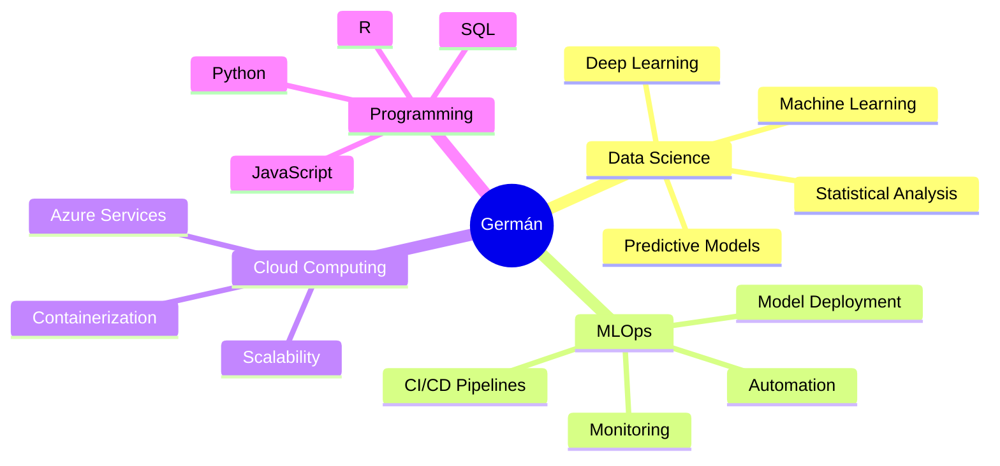

<div align="center">

# ¡Hola! Soy Germán Alonso Rodríguez 👋


<p align="center">
  
  
  
  
</p>

</div>

---

## 🚀 Sobre Mí

```python
class DataScientist:
    def __init__(self):
        self.name = "Germán Alonso Rodríguez Díaz"
        self.role = "Data Scientist & ML Engineer"
        self.location = "Medellín, Colombia"
        self.company = "Data Scientist"
        
    def say_hi(self):
        print("¡Gracias por visitar mi perfil!")
        
    def current_focus(self):
        return [
            "🔬 Machine Learning & Deep Learning",
            "🔄 MLOps & Automatización",
            "📊 Análisis Estadístico Avanzado",
            "🐳 Containerización con Docker",
            "☁️ Cloud Computing (Azure)"
        ]

me = DataScientist()
me.say_hi()
```

Soy un **Data Scientist** apasionado por transformar datos en insights accionables. Mi enfoque actual está en **Machine Learning**, **MLOps** y el desarrollo de soluciones escalables que generen valor tangible para las organizaciones.

---

## 🛠️ Stack Tecnológico

<details>
<summary><b>🧠 Lenguajes de Programación</b></summary>


</details>

<details>
<summary><b>🤖 Machine Learning & AI</b></summary>


</details>

<details>
<summary><b>📊 Análisis de Datos</b></summary>


</details>

<details>
<summary><b>🔧 DevOps & MLOps</b></summary>


</details>

<details>
<summary><b>☁️ Cloud & Databases</b></summary>


</details>

---

## 📈 Estadísticas de GitHub

<div align="center">


</div>

<div align="center">


</div>

<div align="center">


</div>

---

## 🏆 Proyectos Destacados

<div align="center">

| 🚀 Proyecto | 📝 Descripción | 🛠️ Tecnologías | 📅 Estado |
|-------------|----------------|----------------|----------|
| [**Análisis Demográfico Bogotá**](https://github.com/ingermanr/demographic-accesibility-bogota) | Sistema completo de análisis demográfico y accesibilidad a centros de salud con mapas interactivos |    |  **Jun 2025** |
| [**Sistema de Detección de Fraude**](https://github.com/ingermanr/fraud_det_sys) | Sistema MLOps completo para detección de fraude en tiempo real |   |  **May 2025** |
| [**Proyecto ExeDataSc**](https://github.com/ingermanr/proyecto_exedatasc) | Proyecto integral desde análisis de datos hasta ciencia de datos |   |  **Abr 2025** |
| [**Especialización en ML**](https://github.com/ingermanr/esp_ml_ean) | Cuadernos y prácticas avanzadas de Machine Learning (255MB+ de contenido) |   |  **Abr 2025** |
| [**GitHub Actions**](https://github.com/ingermanr/github-actions) | Flujos de trabajo automatizados para CI/CD y DevOps |   |  **Sep 2024** |

</div>

---

## 🎯 Áreas de Especialización

<div align="center">


```mermaid
mindmap
  root((Germán))
    Data Science
      Machine Learning
      Deep Learning
      Statistical Analysis
      Predictive Models
    MLOps
      Model Deployment
      CI/CD Pipelines
      Monitoring
      Automation
    Cloud Computing
      Azure Services
      Containerization
      Scalability
    Programming
      Python
      R
      SQL
      JavaScript
```

</div>

---

## 🏅 Certificaciones y Logros

<div align="center">


</div>

---

## 🌐 Conecta Conmigo

<div align="center">

[](https://ingermanr.github.io)
[](https://linkedin.com/in/germanalonsodriguez)
[](https://kaggle.com/germanrodriguezdiaz)
[](mailto:ingenierogermanr@gmail.com)

</div>

---

<div align="center">

### 💭 Quote of the Day
*"In God we trust. All others must bring data."* - W. Edwards Deming

**⭐ Si te gusta mi trabajo, no olvides darle una estrella a mis repositorios ⭐**


---

💙 **Gracias por visitar mi perfil** 💙


</div>
